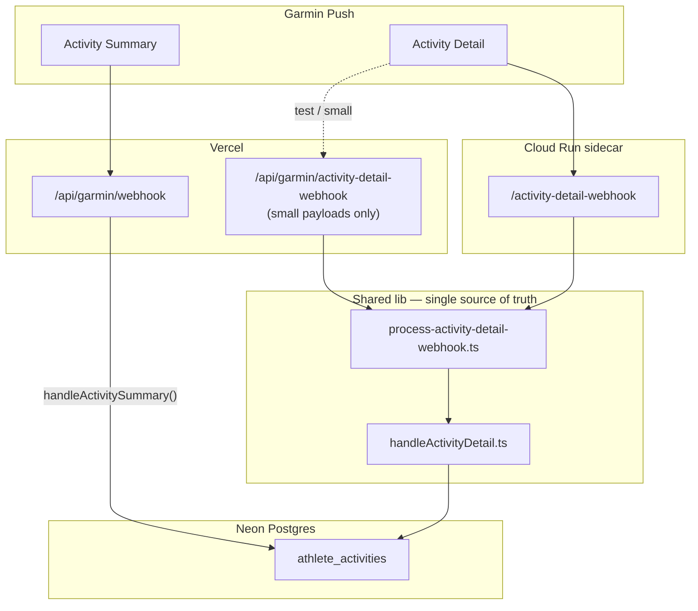

# Garmin Activity Detail Ingest — Agent Guide

This doc captures the full context behind Garmin **activity detail** hydration: why Cloud Run exists, how summary/detail rows relate, the Garmin test-tool ID mismatch trap, and the **detail fallback** that creates a minimal row when summary is missing.

Read this before touching `handleActivityDetail.ts`, the Cloud Run sidecar, or Garmin portal webhook URLs.

---

## TL;DR for future agents

1. **Activity Summary** → Vercel `/api/garmin/webhook` → creates `athlete_activities` row (`summaryData`, no `detailData` yet).
2. **Activity Detail** → Cloud Run `/activity-detail-webhook` → updates existing row (`detailData`, `hydratedAt`).
3. Real production payloads can be **>4.5 MB**; Vercel rejects them with `FUNCTION_PAYLOAD_TOO_LARGE` before our code runs. Cloud Run accepts up to ~30 MB.
4. Garmin's **test tool** often sends summary and detail with **different activity IDs**. That is a fixture bug, not proof prod is broken.
5. If detail arrives with no matching summary row, we **always** try a fallback create (no env var). Skip only when athlete cannot be resolved.
6. **Do not** keep redeploying Cloud Run unless the shared `lib/garmin-events/*` code actually changed and you need that code live on Cloud Run. Vercel auto-deploys on push; Cloud Run does not.

---

## Why two endpoints?

| Event | Garmin portal URL | Runtime | Body limit |
|-------|-------------------|---------|------------|
| Activity Summary | Vercel `/api/garmin/webhook` | Vercel | ~4.5 MB |
| Activity Files | Vercel `/api/garmin/webhook` | Vercel | ~4.5 MB |
| Activity Detail | Cloud Run `/activity-detail-webhook` | Cloud Run | ~30 MB (configured) |
| Health (sleep/dailies) | Vercel `/api/garmin/health-webhook` | Vercel | ~4.5 MB |

Production Cloud Run URL (as of May 2026):

```text
https://garmin-activity-detail-ingest-288485670558.us-east4.run.app/activity-detail-webhook
```

Small Garmin test payloads still work on Vercel at `/api/garmin/activity-detail-webhook` for backward compatibility.

---

## Architecture



Both Vercel and Cloud Run call the **same** shared processor. Cloud Run must **await** processing before returning 200 (request-based CPU); Vercel uses `waitUntil()` in the background.

---

## Normal ingest lifecycle

### 1. Summary creates the row

`lib/garmin-events/handleActivitySummary.ts`

- Requires Garmin `userId` (root or on activity object).
- Resolves athlete via `getAthleteByGarminUserId()`.
- `sourceActivityId = activity.activityId ?? activity.summaryId`
- Stores full payload in `summaryData`.
- `detailData` and `hydratedAt` are null until detail arrives.
- `ingestionStatus = RECEIVED`, then workout matching runs.

### 2. Detail hydrates the row

`lib/garmin-events/handleActivityDetail.ts`

- Derives candidate IDs (see below).
- `updateMany` on `athlete_activities` where `sourceActivityId IN (candidates)`.
- Sets `detailData` (full detail payload) and `hydratedAt = now`.
- Runs lap/workout pipeline best-effort (`parseDetailData` → `writeLapsToWorkout`, workout detail snapshot).

### 3. App reads from DB

The Next.js app does not receive detail over HTTP at request time. It reads hydrated rows from `athlete_activities.detailData`.

---

## Detail ID matching (multiple shapes)

Garmin detail payloads are inconsistent. We derive **candidate** `sourceActivityId` values from:

1. `detail.activityId`
2. `detail.summary.activityId`
3. `detail.summaryId` with `-detail` suffix stripped (e.g. `14229628-detail` → `14229628`)

Implementation: `activityIdCandidates()` in `handleActivityDetail.ts`.

Payload may arrive as:

```json
{ "userId": "...", "activityDetails": [ { ... } ] }
```

or a **raw JSON array** (Garmin test tool):

```json
[ { "summaryId": "14229628-detail", "activityId": 14229628, "summary": { "activityId": 13938903 }, ... } ]
```

Raw arrays are normalized in `process-activity-detail-webhook.ts` via `normalizeParsedToBody()`.

---

## The Garmin test-tool rabbit hole (read this before debugging)

### Symptom

Cloud Run logs show detail received:

```text
sourceActivityId: '14137772'
garminUserId: 'abbd1d39-99d7-4dd4-a09f-db9b68718b5b'
```

DB query for `14137772` returns **0 rows**. Summary row exists for a **different** ID:

```text
sourceActivityId = 14529385
hydratedAt = null
has_detail = false
```

### Root cause

Garmin's **Activity Summary** test and **Activity Detail** test use **synthetic mismatched IDs**. Summary created `14529385`; detail arrived for `14137772`. In real activities, summary and detail share the same Garmin activity ID and hydration works.

### False alarms we hit

| Observation | Wrong conclusion | Actual cause |
|-------------|------------------|--------------|
| `FUNCTION_PAYLOAD_TOO_LARGE` on Vercel | Detail handler broken | Payload never reached handler; body > ~4.5 MB |
| Cloud Run on `gcr.io/cloudrun/placeholder` | Code not deployed | Service created but real image not attached; fix via Edit & deploy new revision |
| Detail logged but `hydratedAt` null | Cloud Run DB write broken | No row with matching `sourceActivityId` |
| `matched no rows` in logs | Prod ingest broken | Test fixture ID mismatch (or missing summary) |

### Validation query

```sql
SELECT
  "sourceActivityId",
  "hydratedAt",
  "detailData" IS NOT NULL AS has_detail,
  "summaryData"->>'userId' AS summary_user_id,
  "summaryData"->>'activityId' AS summary_activity_id,
  "createdAt"
FROM athlete_activities
WHERE "sourceActivityId" IN ('14137772', '14529385')
   OR source = 'garmin'
ORDER BY "createdAt" DESC
LIMIT 25;
```

For real runs, expect `sourceActivityId` from summary to appear in detail candidate IDs and `has_detail = true` after detail webhook.

---

## Detail fallback (always on)

**Added:** commits `30141e3`, `178c9e4` (May 2026).

When detail `updateMany` matches **zero** rows, we create a minimal `athlete_activities` row instead of dropping the payload.

### When it runs

```text
Detail arrives → try update by candidate IDs → no match → create fallback row
```

No environment variable. This is intentional — it's a resilience fallback for missed summaries, ID quirks, and Garmin test fixtures.

### Fallback row fields

| Field | Source |
|-------|--------|
| `sourceActivityId` | First candidate ID (`ids[0]`, usually `detail.activityId`) |
| `source` | `'garmin'` |
| `athleteId` | From `userId` → `getAthleteByGarminUserId()`; if no `userId`, scan recent `summaryData.userId` from last 50 garmin rows |
| `activityName`, `activityType`, metrics | `detail.summary` when present (via `normalizeActivityFields`) |
| `summaryData` | `detail.summary` or `null` |
| `detailData` | Full detail payload |
| `hydratedAt` | `now` |
| `ingestionStatus` | `RECEIVED` (running types) or `INELIGIBLE` (non-running) |

### Safety

- **No athlete → no row.** Logs `Detail fallback skipped: no athlete resolved`.
- **`sourceActivityId` unique** → `activityExists()` check before create; duplicates skipped.
- Lap/workout pipeline runs after row exists (same as normal update path).

### Log lines to grep

| Log | Meaning |
|-----|---------|
| `✅ Saved activity detail` | Updated existing row |
| `✅ Created activity from detail fallback` | Fallback create succeeded |
| `⚠️ Detail fallback skipped: no athlete resolved` | Cannot create without athlete |
| `⚠️ Detail fallback skipped: activity already exists` | Race or duplicate |
| `⚠️ Activity detail update matched no rows` | Removed — fallback handles this now |

---

## Key files

| File | Role |
|------|------|
| `lib/garmin-events/handleActivitySummary.ts` | Summary → new `athlete_activities` row |
| `lib/garmin-events/handleActivityDetail.ts` | Detail hydrate + fallback create |
| `lib/garmin-events/process-activity-detail-webhook.ts` | Parse body, extract meta, call handler |
| `lib/garmin-events/archive-activity-detail-payload.ts` | Optional GCS/Vercel Blob raw archive |
| `lib/garmin-events/handleActivityDetail.test.ts` | Unit tests for ID derivation |
| `app/api/garmin/activity-detail-webhook/route.ts` | Vercel route (small payloads) |
| `services/garmin-activity-detail-ingest/src/server.ts` | Cloud Run Express app |
| `services/garmin-activity-detail-ingest/README.md` | Deploy/runbook (ops) |
| `Dockerfile.garmin-activity-detail-ingest` | Cloud Run image build |

Shared lib is copied into the Cloud Run Docker image at build time. **Pushing to GitHub updates Vercel immediately; Cloud Run only updates when a new revision is deployed.**

---

## Cloud Run deployment notes (minimal)

Only redeploy Cloud Run when shared ingest code changes and you need it live for large detail payloads.

Required env on Cloud Run:

- `DATABASE_URL` — same pooled Neon URL as Vercel

Optional:

- `MAX_BODY_BYTES` — default `31457280` (30 MB)
- `GCS_ARCHIVE_BUCKET` — raw payload archive

Build context must be **repo root** (`gofastapp-mvp`), Dockerfile:

```text
Dockerfile.garmin-activity-detail-ingest
```

Gotcha: new Cloud Run services may show `gcr.io/cloudrun/placeholder` until you deploy a real image (Edit & deploy new revision in console or `gcloud run deploy`).

---

## Local verification (no Cloud Run)

```bash
# Unit tests — ID derivation
cd gofastapp-mvp
node --import tsx --test lib/garmin-events/handleActivityDetail.test.ts

# Payload limit / parse smoke test
cd services/garmin-activity-detail-ingest
npm run verify:payload-limits
```

---

## Agent checklist: "detail not hydrating"

1. **Which endpoint received it?** Cloud Run logs vs Vercel logs.
2. **Payload size?** If Vercel + large payload → `FUNCTION_PAYLOAD_TOO_LARGE` → expected; use Cloud Run.
3. **Does a summary row exist?** Query by `sourceActivityId` and candidate IDs.
4. **Same ID in prod?** Test-tool mismatch is normal; real activities should align.
5. **Athlete linked?** Summary needs `userId`; detail fallback needs resolvable athlete.
6. **Cloud Run code version?** Git push ≠ Cloud Run deploy. Check revision image tag vs latest commit if behavior doesn't match repo.
7. **Don't** add another env var gate for fallback — it's always on by design.

---

## Related docs

- `services/garmin-activity-detail-ingest/README.md` — Cloud Run deploy/runbook
- `GARMIN_TESTING_GUIDE.md` — manual Garmin testing
- `GARMIN_ROUTING_MAP.md` — OAuth + webhook route map (summary-centric)
- `docs/GARMIN_HEALTH_WEBHOOK_REFACTOR.md` — health vs activity API split

---

## Commit history (this rabbit hole)

| Commit | What |
|--------|------|
| `fa7ffc9` | Cloud Run sidecar + shared detail processor |
| `11bc441` | Cloud Run awaits processing before 200 (request-based CPU) |
| `30141e3` | Detail ID candidates, raw array payloads, opt-in fallback |
| `178c9e4` | Fallback always on (removed env var gate) |
