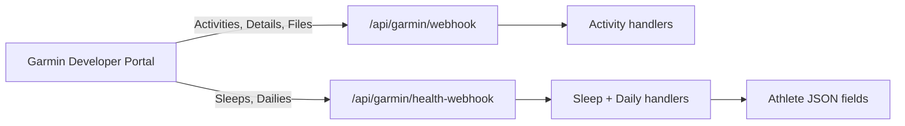

# Garmin Health Webhook Refactor

## Problem

Today **one URL** (`/api/garmin/webhook`) receives both:

- **Activity API** — activities, activityDetails, activityFiles (training-critical)
- **Health API** — sleeps, dailies, stress, HRV, etc. (wellness)

That causes two issues:

1. **413 noise** — Health PING callbacks (often `GET` with long `callbackURL` query strings) hit the same route as activities. Vercel logs showed `GET /api/garmin/webhook` → `413` with `source: "static"` — those never reached our POST handler.
2. **Coupling** — Activity ingestion and wellness storage share one large route module; health endpoints we don't use still point at production.

## Target architecture



| Endpoint | Garmin portal config | Handles |
|----------|---------------------|---------|
| `POST/PUT /api/garmin/webhook` | Activity Summary, Activity Details, Activity Files | Training ingest only |
| `POST/PUT /api/garmin/health-webhook` | **Sleeps**, **Dailies** (body battery) | `athlete_health_records` (`sleep`, `daily`) |

**Disable or leave blank** in portal (for now): epochs, stressDetails, hrv, pulseOx, respiration, bodyComps, userMetrics — we don't store these yet.

Permissions and deregistration stay on their existing dedicated routes (`/api/garmin/permissions`, `/api/garmin/deregistration`).

## URL to register in Garmin

Production:

```
https://pr.gofastcrushgoals.com/api/garmin/health-webhook
```

(Or your `SERVER_URL` + `/api/garmin/health-webhook`.)

Activity webhook stays:

```
https://pr.gofastcrushgoals.com/api/garmin/webhook
```

Optional env override:

```
GARMIN_HEALTH_WEBHOOK_URI="https://pr.gofastcrushgoals.com/api/garmin/health-webhook"
```

## Portal checklist

1. **Activity API** → webhook: `/api/garmin/webhook` (unchanged)
2. **Health API** → enable only:
   - **Sleeps** → `/api/garmin/health-webhook`
   - **Dailies** → `/api/garmin/health-webhook`
3. **Disable** unused Health endpoints (stress, HRV, epochs, etc.) until we add handlers
4. Re-save and verify with a test sync from Garmin Connect app

## Code changes (this PR)

| File | Change |
|------|--------|
| `app/api/garmin/health-webhook/route.ts` | New health-only webhook |
| `lib/garmin-events/process-health-webhook.ts` | Shared sleep + daily dispatch |
| `lib/garmin-events/handleDailySummary.ts` | Upsert daily → `athlete_health_records` |
| `app/api/garmin/webhook/route.ts` | Remove sleep handling; log hint if health keys arrive |
| `lib/garmin-oauth.ts` | `getGarminHealthWebhookUri()` |
| `prisma/schema.prisma` | `athlete_health_records` table |
| `components/health/HealthDashboard.tsx` | Sleep + Body Battery on `/health` |
| `app/health/page.tsx` | Health nav hydrate |

## Storage model

| Field / table | Source | Display |
|-------|--------|---------|
| `athlete_health_records` (`healthType=sleep`) | `sleeps[]` push/ping | Sleep stages, calendar date |
| `athlete_health_records` (`healthType=daily`) | `dailies[]` push/ping | Body battery high/low/recent, calendar date |

Raw Garmin JSON lives on health rows (`summaryData`). Profile API returns compact derived objects only (`garmin_user_daily`, `garmin_user_sleep` on the client payload).

## Follow-ups (not in scope)

- Backfill historical sleep/daily from Garmin pull API
- Stress / HRV widgets
- Separate no-op routes per health type if Garmin requires distinct URLs
- Alerting when health webhook receives unknown keys

## Verification

1. Sync watch in Garmin Connect
2. Check Vercel logs for `[GARMIN HEALTH]` on `POST /api/garmin/health-webhook`
3. Open `/profile` — Sleep + Body Battery cards when data exists
4. Confirm activity webhook logs no longer mention sleep processing
