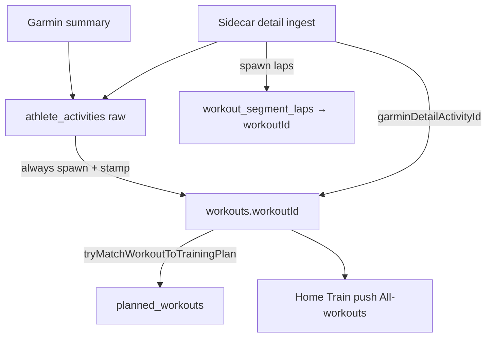

# Ingest → workoutId spawn

Analysis of Garmin ingest, spawned workouts, and what is *not* plan-match.

Product surfaces speak **workout**. Garmin stays **raw**. Do not conflate the two.

---

## Two-fold reason

1. **Split planned.** `planned_workouts` is strictly the prescription. Unmatched Garmin never writes onto it. The plan stays clean if the spawned workout never snaps.

2. **Go all-in on spawn.** Promote-unmatched was a failed half-spawn. If we spawn anyway, always seed a `workouts` row for the finished run. That spawned `workoutId` is the worker.

Unmatched spawn = a workout with no `plannedWorkoutId`. Still a workout. Not an “activity product.”

---

## Canon flow

```text
Garmin summary webhook
  → athlete_activities          raw row (sourceActivityId, summaryData)

Cloud Run sidecar garmin-activity-detail-ingest
  → same athlete_activities row  detail payload completes the raw row

Always spawn workouts row
  → workoutId                    product object; stamp actuals

Spawned workout searches the plan
  → plannedWorkoutId snap        or stay unmatched spawn

Sidecar / detail uses Garmin pointer
  → garminDetailActivityId       find workout, spawn laps onto workoutId
```



---

## IDs — do not mix

| Field | Layer | Job |
|-------|--------|-----|
| `athlete_activities.id` | Garmin raw | GoFast id for the ingest row |
| `sourceActivityId` | Garmin raw | Garmin’s external id (dedupe) |
| `workouts.id` (`workoutId`) | Product | Spawned worker. Open, notify, reflect, list |
| `plannedWorkoutId` | Plan snap | FK on spawned workout if it found a plan day. **This is the product ref.** |
| `garminDetailActivityId` (today `garminDetailActivityId`) | Garmin glue | Pointer so sidecar can complete detail and spawn laps. **Not plan-match.** |

Do not invent `matchedPlanWorkoutId`. The snap is already `plannedWorkoutId`.

---

## Garmin pointer (do not burn)

We almost deleted splits and detail ingest by treating `garminDetailActivityId` as a product ghost.

**What it actually is**

- Garmin ingest writes the **activity row only**.
- Sidecar **completes that same row** with detail.
- Detail **spawns laps**. Laps hang off **`workoutId`**.
- `garminDetailActivityId` on the workout is how sidecar **finds** that workout.

**Do not** stop the apply write. **Do not** drop the column. **Do not** change sidecar lookup.

**Do** rename `garminDetailActivityId` → `garminDetailActivityId` so nobody thinks it means “matched to the training plan.”

**Do not** select or gate Home / Train / lists / push / “completed” on this field.

---

## Ghost we are leaving behind

`tryMatchActivityToTrainingWorkout(activityId)` — activity goes hunting for a workout/plan. Wrong subject.

Right shape: **seed `workoutId` first**, then `tryMatchWorkoutToTrainingPlan(workoutId)`. The spawned workout looks for planned and snaps onto itself.

`applyActivityToWorkout` is a **stamp helper** (actuals + Garmin pointer). The name is leftover.

---

## Product surfaces (always `workoutId`)

Training is the hub after Performance / Activities left the tab bar.

| Surface | Object | Open |
|---------|--------|------|
| Home last 2 + add reflection | spawned workouts | `/workouts/{id}` |
| Training plan week | planned days; completed = spawned + stamps | `workoutId` or `plannedWorkoutId` to open prescribe |
| All activities (button copy) | spawned workouts, filter by sport | `/workouts/{id}` |
| Finish push | congrats, see your workout | `/workouts/{id}` |
| Performance | weekly rollup of spawned rows | spoke from Train |
| Thoughts / photo | same workout | `/workouts/{id}` |

Finish push is **surfacing** (no activities tab) — not a pace/split recap. Splits live on the workout page after sidecar laps.

List payload: `id`, `plannedWorkoutId`, `planId`, `title`, `workoutType`, `date`, stamps (`actualDistanceMeters`, `actualAvgPaceSecPerMile`, `actualDurationSeconds`). Order by workout `date`. Never `/activities/{id}`.

---

## Completed

Completed = spawned workout with stamps (optional `plannedWorkoutId` snap).

Not `garminDetailActivityId`. Not “activity synced.”
